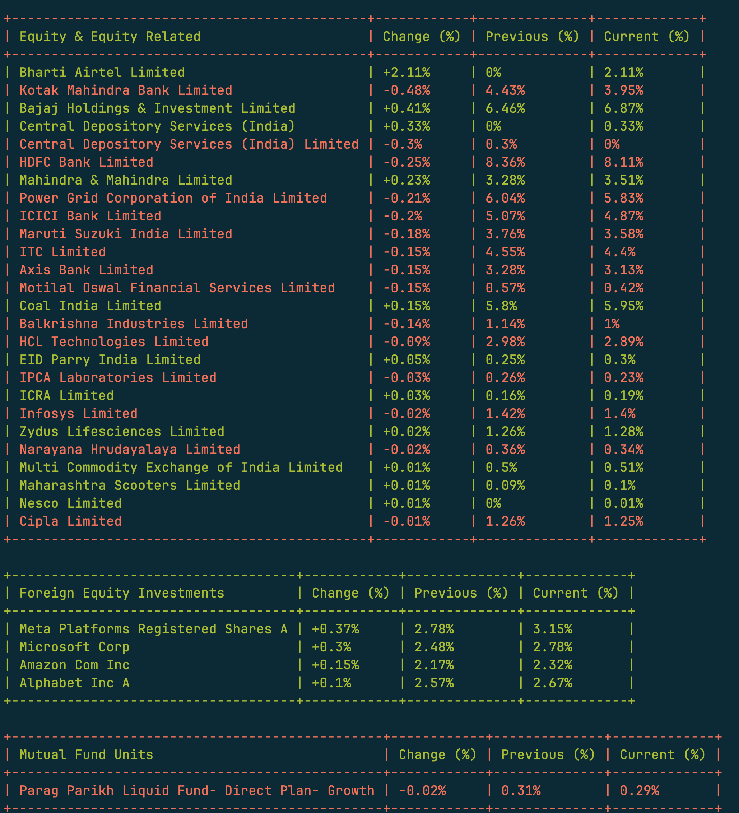

# PPFAS Mutual Fund Portfolio Parser

## Description

This is a command-line tool for analyzing the monthly changes in a mutual fund's portfolio. It downloads the official monthly portfolio statements from the Parag Parikh Financial Advisory Services (PPFAS) AMC, compares the holdings between two different months, and generates a detailed report highlighting the changes. The tool is designed to provide insights into the fund manager's trading activity by distinguishing between active trades and passive changes due to market price fluctuations.

## Features

- Automatically downloads monthly portfolio reports for specified PPFAS funds.
- Parses complex Excel reports to extract detailed holding information.
- Compares portfolios from two different months.
- Generates a summary table of all portfolio changes.
- Implements "smart sorting" to prioritize actively traded stocks (where shares were bought or sold).
- Visually distinguishes between active trades and passive price-driven changes in the output.
- Calculates and displays implied share prices to provide context on market movements.
- Provides a detailed section-wise breakdown of the portfolio (e.g., Equity, REITs, Foreign Equity).
- Company names are word-wrapped for better readability in the console.

## Usage

The script is run from the command line.

```bash
php index.php parse [options] [--] [<month-diff-x>]
```

**Arguments:**

- `month-diff-x`: Optional. Specifies the older month for comparison, as a difference from the current month. For example, `2` means two months ago. Defaults to `2`.

**Options:**

- `-f, --fund-name`: The name of the fund to analyze. Supported values are `flexi`, `liquid`, `hybrid`, `tax`. Defaults to `tax`.
- `-y, --month-diff-y`: Specifies the newer month for comparison, as a difference from the current month. For example, `1` means last month. Defaults to `1`.
- `-o, --open`: **(macOS only)** Downloads and opens the latest month's Excel file directly.
- `--help`: Display help for the command.

**Example:**

To compare last month's report with the report from two months ago for the flexi cap fund:

```bash
php index.php parse -f flexi -y 1 2
```

## Output Description

The tool outputs one or more tables directly to the console.

- **Main Table:** Shows the overall changes in the portfolio.
- **Section Tables:** Provide a breakdown of changes for each section of the portfolio (e.g., "Equity & Equity Related").

### Columns

- **Company Name**: The name of the holding.
- **Change (%)**: The change in the stock's percentage of the total portfolio. This is displayed as `0.00%` if no shares were traded, to indicate a passive change.
- **Old %**: The portfolio percentage in the older report.
- **New %**: The portfolio percentage in the newer report.
- **Change (Shares)**: The number of shares bought (+) or sold (-).
- **Old Price**: The implied price per share at the end of the older month.
- **New Price**: The implied price per share at the end of the newer month.

### Sorting

The table is sorted to show actively traded stocks first, ordered by the magnitude of their trade value (share price * number of shares traded). Stocks with only price-driven changes are listed below them.

## For Developers

This project uses `php_codesniffer` for linting (PSR-12) and `phpstan` for static analysis (Level 9).

- **Run Linter:**
  ```bash
  composer lint
  ```

- **Run Static Analysis:**
  ```bash
  composer stan
  ```

## Screenshot


